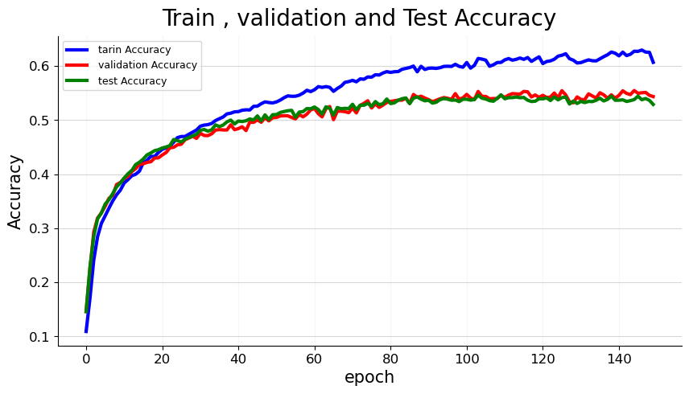
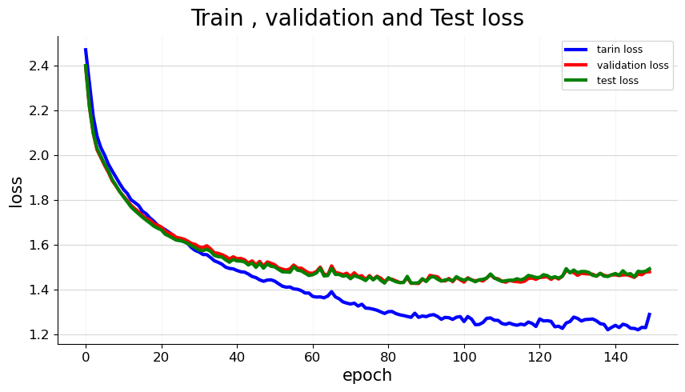

# Neural Network Implementation from Scratch using NumPy


*Caption: https://pub.towardsai.net/implement-a-neural-network-from-scratch-with-numpy-67db290771b and https://commons.wikimedia.org/wiki/File:Multi-Layer_Neural_Network-Vector-Blank.svg*

This repository contains an implementation of a neural network from scratch using only NumPy, a fundamental library for numerical computing in Python. The neural network is designed to perform tasks such as classification, regression, or any other supervised learning problem.

## Table of Contents

- [Introduction](#introduction)
- [Features](#features)
- [Getting Started](#getting-started)
  - [Prerequisites](#prerequisites)
  - [Installation](#installation)
- [Usage](#usage)
- [Examples](#examples)
- [Contributing](#contributing)
- [License](#license)

## Introduction

Neural networks have shown remarkable capabilities in various machine learning tasks, and understanding their inner workings is crucial for mastering machine learning and deep learning concepts. This project serves as an educational resource and a practical implementation of a neural network using only NumPy.


train.py file will run the net with parameters specified in config.yml.

test.py file will load the net with parameters specified in config.yml and return the loss and accuracy.

train_BGD.py run the net with parameters specified in config.yml but all data will be on same bath by other words batch gradient decent.

train_SGD.py run the net with parameters specified in config.yml but each data will be on diffrent bath by other words stochastic gradient decent.

train_validation_test.py is the same as train.py file but in the validation process the test data will fed to net and loss and accuracy of test will be kept as a list.

## Features

- Implementation of a feedforward neural network with customizable architecture.
- Support for various activation functions (e.g., ReLU, sigmoid, tanh).
- Vectorized operations for efficient computation.
- Forward and backward propagation for training.
- Mini-batch gradient descent for optimization.

## Getting Started

### Prerequisites

To run the code, you'll need:

- Python (>= 3.x)
- NumPy (>= 1.16)

### Installation

1. Clone the repository:

   ```bash
   
   git clone https://github.com/yriyazi/Neural-Network-Implementation-from-Scratch-using-NumPy.git
   cd Neural-Network-Implementation-from-Scratch-using-NumPy
   ```

2. Create a virtual environment (optional but recommended):

   ```bash
   python -m venv venv
   source venv/bin/activate  # On Windows: .\venv\Scripts\activate
   ```

3. Install required packages:

   ```bash
   pip install numpy
   ```

## Usage

You can create, train, and test your neural network by utilizing the provided modules and classes. Modify the architecture, hyperparameters, and dataset according to your task.

1. set up the dataset (dataset was binary Cifar-10)

2. Modifying Network Structure
    To modify the neural network's structure, you can use the `config.yaml` file. Inside the `model` section of the config file, create a list where each element specifies the layer's configuration. Each element should contain the following information:
   
```Python
activation_function = {1:'ReLU',
                       2:'LeakyReLu',
                       3:'tangenthyperbolic',
                       4:'sigmoid',
                       5:'Softmax',
                       6:'Linear',}
```

```yaml
model:
      [
        [neuron_input, mu, sigma, bias, regularization_L2, activation_function, dropout],
        [neuron_input, mu, sigma, bias, regularization_L2, activation_function, dropout],
      ]
```

For example:

```yaml
model:
      [
      [16, 0, 1, 0, 0, 4, 0.0],
      [10, 0, 1, 0, 0, 5, 0.0],
      ]
```
3. running train.py


## Additional Files and Folders

- [`config.yaml`](config.yaml): Configuration file for hyperparameters and settings.
- [`datasets`](datasets/): Directory to store datasets used for training and testing.
- [`losses`](losses/): Implementation of different loss functions.
- [`nets`](nets/): Definition of various neural network architectures.
- [`test.py`](test.py): Script to test the trained neural network.
- [`train.py`](train.py): Script to train the neural network.
- [`utils`](utils/): Utility functions used in the project.
- [`dataloaders`](dataloaders/): Data loading utilities.
- [`deeplearning`](deeplearning/): Deep learning related utilities.
- [`Model`](Model/): Saved model checkpoints and parameters.






*Caption: Some Output*


## Contributing

Contributions are welcome! If you find any issues or have improvements to suggest, feel free to open a pull request.

## License

This project is licensed under the MIT License - see the [LICENSE](LICENSE) file for details.

---

*Disclaimer: This project is for educational purposes and may not cover all optimization techniques and considerations for production-level neural networks.*
```


